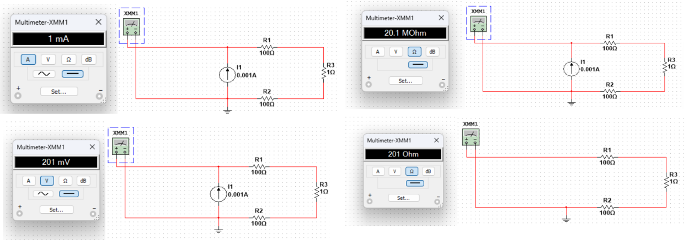
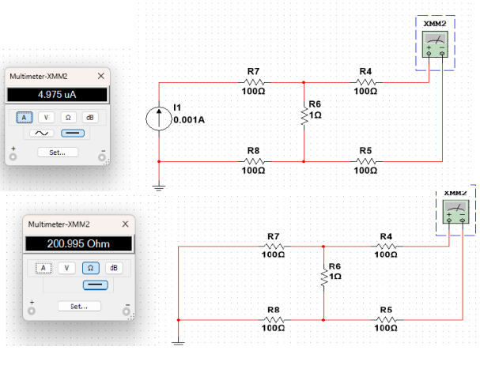
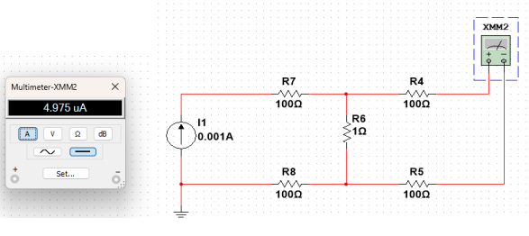
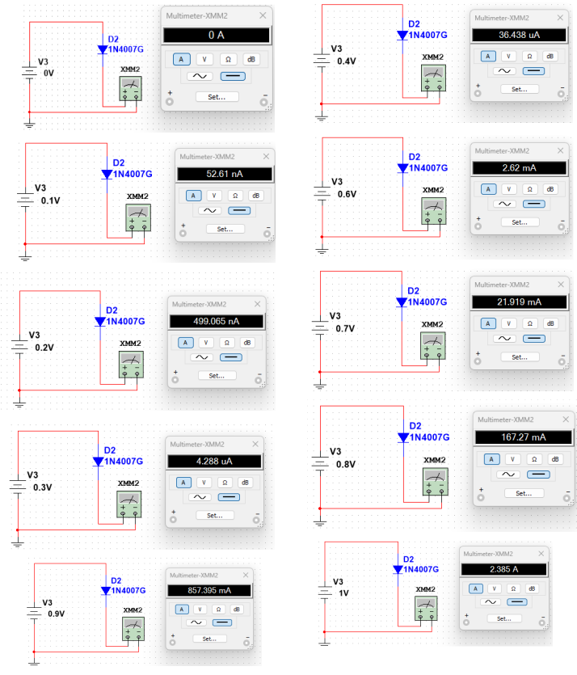
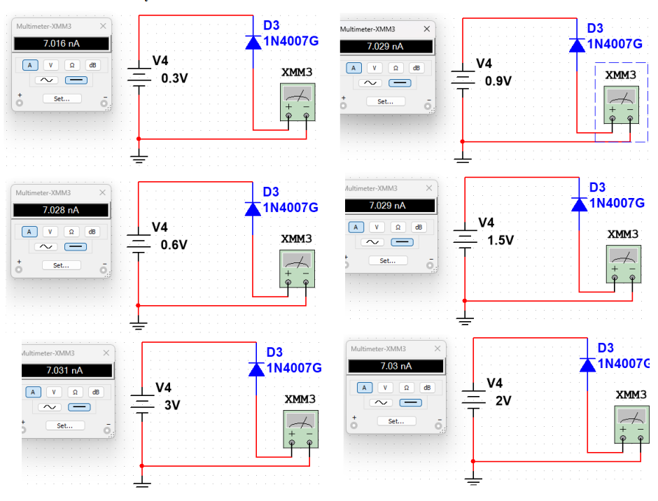
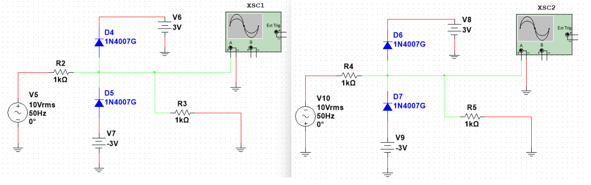
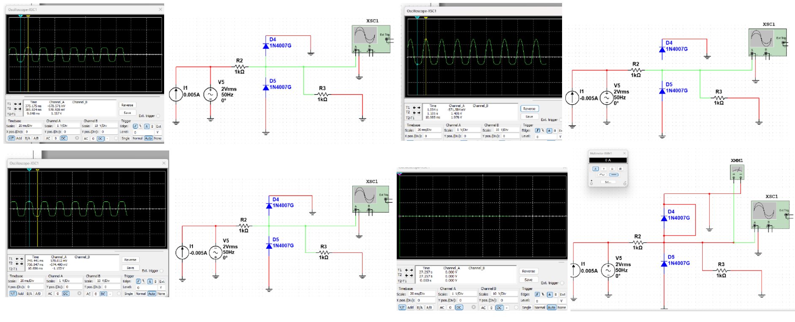

    <h3>Київський політехнічний інститут імені Ігоря Сікорського</h3>
    <h3>Факультет робототехніки та приладобудування</h3>
    <h4>Кафедра автоматизації та систем неруйнівного контролю</h4>
       

    <h3>Практична робота № 2</h3>
    <h3>Вивчення методик визначення низьких опорів. Методика перевірки стану захисних діодів</h3>

Студент: Погорєлов Богдан 
Група: ПК-51мп 

2026 рік        

## 1. Мета роботи

Навчитися вимірювати низькі опори з високою точністю за допомогою чотирьохпровідної схеми Кельвіна; перевіряти стан обмежуючих діодів та наявність контакту між мікросхемою та тестовим обладнанням.

## 2. Обладнання
* Програмне середовище **NI Multisim**

## 3. Хід роботи

### Завдання 1. Двопровідна схема вимірювання опору

Проведено вимірювання опору шляхом вимірювання напруги та струму, аналогічно до того, як це відбувається у звичайному мультиметрі (двопровідна схема).

 Рис. 1 

  
Моделювання двопровідної схеми вимірювання опору

### Завдання 2. Чотирьохпровідна схема вимірювання опору

Проведено вимірювання опору за допомогою чотирьохпровідної схеми Кельвіна для компенсації впливу опору провідників.

 Рис. 2 

  
Моделювання чотирьохпровідної схеми вимірювання

### Завдання 3. Вимірювання опору мультиметром SDM-3055

Виконано вимірювання опору мультиметром SDM-3055 за допомогою чотирьохпровідної схеми.

 Рис. 3 

  
Вимірювання опору за допомогою чотирьохпровідної схеми мультиметром

### Завдання 4. Перевірка правильності роботи напівпровідникових діодів

Знято показники для прямого та зворотного зміщення для оцінки працездатності напівпровідникових діодів 1N4007.

 Рис. 4 

  
Дослідження діода 1N4007 при прямому включенні

 Рис. 5 

  
Дослідження діода 1N4007 при зворотному включенні (струм витоку)

### Завдання 5. Дослідження правильності роботи схеми обмеження напруги

Знято передавальні характеристики обмежувача напруги на діодах.

Таблиця 2.1: Характеристика схеми обмеження напруги (додатні значення)

| Вхідна напруга $V_{in}$, В | Вихідна напруга $V_{out}$, В |
| :--- | :--- |
| 0.1 | 0.198 |
| 0.2 | 0.199 |
| 0.3 | 0.597 |
| 0.4 | 0.563 |
| 0.5 | 0.703 |
| 0.6 | 0.844 |
| 0.7 | 0.987 |
| 0.8 | 1.125 |
| 0.9 | 1.270 |
| 1.0 | 1.411 |
| 2.0 | 2.810 |
| 3.0 | 4.226 |
| 4.0 | 5.631 |
| 5.0 | 6.897 |
| 6.0 | 7.131 |
| 7.0 | 7.199 |
| 8.0 | 7.238 |
| 9.0 | 7.267 |
| 10.0 | 7.290 |

Таблиця 2.2: Характеристика схеми обмеження напруги (від'ємні значення)

| Вхідна напруга $V_{in}$, В | Вихідна напруга $V_{out}$, В |
| :--- | :--- |
| 0.1 | -0.198 |
| 0.2 | -0.199 |
| 0.3 | -0.597 |
| 0.4 | -0.563 |
| 0.5 | -0.703 |
| 0.6 | -0.844 |
| 0.7 | -0.987 |
| 0.8 | -1.125 |
| 0.9 | -1.270 |
| 1.0 | -1.411 |
| 2.0 | -2.810 |
| 3.0 | -4.226 |
| 4.0 | -5.631 |
| 5.0 | -6.897 |
| 6.0 | -7.131 |
| 7.0 | -7.199 |
| 8.0 | -7.238 |
| 9.0 | -7.267 |
| 10.0 | -7.290 |

 Рис. 6 

  
Схема обмеження напруги на базі захисних діодів

 Рис. 7 

  
Осцилограми роботи схеми обмеження напруги

### Завдання 6. Оцінка стану захисних діодів

Проведено вимірювання, що дозволяють оцінити стан захисних діодів, що встановлюються на входах ІМС, а також перевіряють наявність фізичного контакту з мікросхемою.

## 4. Висновки

Під час виконання практичної роботи №2 було вивчено методики вимірювання низьких опорів та перевірки стану захисних діодів. У ході досліджень було практично опановано чотирьохпровідну схему Кельвіна, яка, на відміну від звичайної двопровідної схеми, дозволяє мінімізувати похибку від опору вимірювальних провідників і забезпечує високу точність при роботі з низькоомними компонентами (зокрема, з резистором номіналом $0.1\text{ Ом}$).

Використовуючи мультиметр SDM3055 та блок живлення SPD 3303X (змодельовані в середовищі Multisim), було проведено серію вимірювань, результати яких зафіксовано у порівняльних таблицях (Табл. 2.1 та 2.2). Аналіз отриманих даних показує, що схема обмеження напруги працює коректно: при перевищенні порогу відмикання діодів напруга на виході стабілізується. 

Крім того, було перевірено працездатність напівпровідникових діодів 1N4007 та проаналізовано їхній вплив на проходження сигналу за допомогою осцилографа XSC1. Це практично підтвердило їхню здатність виконувати функцію двостороннього обмеження (захисту) в електричних схемах. Отримані навички дозволяють ефективно виявляти несправності обмежуючих діодів та гарантувати надійний контакт між мікросхемами й тестовим обладнанням.