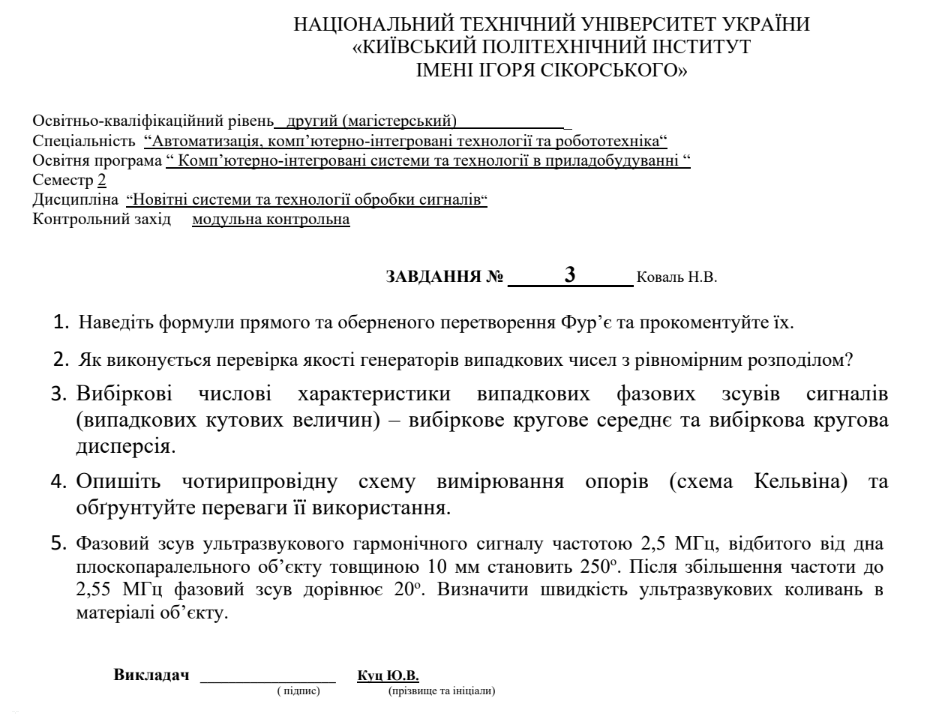

        
    <h3>Національний технічний університет України</h3>
    <h3>«Київський політехнічний інститут імені Ігоря Сікорського»</h3>
       

    <h3>Модульна контрольна робота</h3>
    <h3>з дисципліни “Новітні системи та технології обробки сигналів”</h3>
    <h4>ЗАВДАННЯ № 3 (Коваль Н.В.)</h4>

Освітньо-кваліфікаційний рівень: другий (магістерський) 
Спеціальність: “Автоматизація, комп’ютерно-інтегровані технології та робототехніка“ 
Освітня програма: “Комп’ютерно-інтегровані системи та технології в приладобудуванні“ 
Семестр: 2  
Студент: Погорєлов Богдан 
Група: ПК-51мп 
Викладач: Куц Ю.В. 

2026 рік      

## 1. Формули прямого та оберненого перетворення Фур’є та їх фізичний зміст

У системах обробки сигналів перетворення Фур'є є фундаментальним інструментом для переходу між часовим та частотним представленнями сигналу.

### Неперервне перетворення Фур'є (для аналогових сигналів)

* Пряме перетворення Фур'є:
  $$X(f)=\int_{-\infty}^{\infty}x(t)e^{-j2\pi ft}dt$$
* Обернене перетворення Фур'є:
  $$x(t)=\int_{-\infty}^{\infty}X(f)e^{j2\pi ft}df$$

### Дискретне перетворення Фур'є (ДПФ / DFT для цифрових сигналів)

Оскільки цифрові системи працюють із дискретними відліками, використовують ДПФ для масиву з $N$ точок:
* Пряме ДПФ:
  $$X[k]=\sum_{n=0}^{N-1}x[n]e^{-j\frac{2\pi}{N}kn},\quad k=0,1,\dots,N-1$$
* Обернене ДПФ (IDFT):
  $$x[n]=\frac{1}{N}\sum_{k=0}^{N-1}X[k]e^{j\frac{2\pi}{N}kn},\quad n=0,1,\dots,N-1$$

## 2. Перевірка якості генераторів випадкових чисел з рівномірним розподілом

Генератори випадкових чисел (ГВЧ) є основою для статистичного моделювання та цифрової обробки сигналів. Перевірка їхньої якості на рівномірність розподілу здійснюється за допомогою математико-статистичних критеріїв:

* Критерій згоди $\chi^2$ (Хі-квадрат) Пірсона:
  Діапазон значень розподілу $[0,1]$ розбивається на $M$ однакових інтервалів. Підраховується реальна кількість чисел $n_i$, що потрапили в кожен інтервал, та порівнюється з теоретично очікуваною кількістю $n/M$. Критерій оцінює величину відхилення:
  $$\chi^2=\sum_{i=1}^{M}\frac{(n_i-\frac{n}{M})^2}{\frac{n}{M}}$$
  Отримане значення порівнюють із табличним для заданого рівня значущості.

* Тест Колмогорова-Смирнова:
  Базується на порівнянні емпіричної функції розподілу $F_n(x)$, побудованої за згенерованою вибіркою, з теоретичною функцією рівномірного розподілу $F(x)=x$ (на інтервалі від 0 до 1). Шукається максимальний абсолютний розрив між ними:
  $$D=\max|F_n(x)-F(x)|$$

* Серіальний тест (перевірка на незалежність пар):
  Рівномірно розподілені числа мають бути незалежними. Тест формує пари послідовних чисел $(x_t,x_{t+1})$ як координати точок на двовимірній площині $[0,1]\times[0,1]$. Простір розбивається на квадрати, і перевіряється рівномірність заповнення цих квадратів.

* Спектральний тест:
  Оцінює ГВЧ у частотній області. Дозволяє виявити приховані періодичності або багатовимірні "гратчасті" структури (що є відомим недоліком лінійних конгруентних генераторів).

## 3. Вибіркові числові характеристики випадкових фазових зсувів сигналів (кругові величини)

Для кутових величин або фазових зсувів, що обмежені періодом $[0,2\pi)$ або $[0^\circ,360^\circ)$, класична лінійна статистика не застосовується. Для коректного розрахунку випадкові кути $\theta_i$ ($i=1,\dots,n$) відображають на комплексній площині як одиничні вектори $\vec{r_i}=(\cos\theta_i,\sin\theta_i)$.

### Вибіркове кругове середнє ($\bar{\theta}$)

Спочатку обчислюються середні координати результуючого вектора за осями косинусів ($C$) та синусів ($S$):
$$C=\frac{1}{n}\sum_{i=1}^{n}\cos\theta_i,\quad S=\frac{1}{n}\sum_{i=1}^{n}\sin\theta_i$$

Вибіркове кругове середнє знаходиться за допомогою функції чотириквадрантного арктангенсу:
$$\bar{\theta}=\operatorname{atan2}(S,C)$$

### Вибіркова кругова дисперсія ($V$)

Спочатку визначається довжина середнього результуючого вектора $R$:
$$R=\sqrt{C^2+S^2},\quad 0\le R\le 1$$

Вибіркова кругова дисперсія визначається як:
$$V=1-R$$

* Якщо всі фазові зсуви однакові (спрямовані в один бік), то $R=1\implies V=0$ (ідеальна синхронність, відсутність розкиду).
* Якщо фази хаотично розподілені по всьому колу (абсолютний шум), то $R=0\implies V=1$ (максимальна дисперсія).

## 4. Чотирипровідна схема вимірювання опорів (Схема Кельвіна)

Під час вимірювання малих опорів (менше 10 Ом) класична двопровідна схема дає величезну похибку, оскільки мультиметр вимірює суму опорів: $R_{total}=R_x+2R_{lead}+2R_{contact}$.

### Опис схеми

Чотирипровідна схема повністю розділяє коло збудження (струму) та коло вимірювання (напруги). До досліджуваного резистора $R_x$ підключаються дві пари дротів:
1. Force (Джерело струму): Забезпечує проходження стабілізованого струму $I$ через резистор.
2. Sense (Вольтметр): Підключається безпосередньо до виводів резистора для зняття падіння напруги $U_x$.

### Обґрунтування переваг

Оскільки вхідний опір сучасних цифрових вольтметрів є надзвичайно високим ($R_{in}\ge 10\text{ МОм}$), струм у вимірювальних лініях *Sense* практично дорівнює нулю ($I_{sense}\approx 0$).

Відповідно до закону Ома, падіння напруги на самих вимірювальних провідниках ліній *Sense* відсутнє:
$$U_{lead}=I_{sense}\cdot R_{lead}\approx 0$$

Вольтметр фіксує чисте падіння напруги безпосередньо на потенційних затискачах резистора $R_x$. Повний опір розраховується автоматично:
$$R_x=\frac{U_x}{I}$$

Перевага: Повністю ліквідується вплив опору сполучних дротів та перехідних опорів контактів (крокодилів/щупів) на результат вимірювання.

## 5. Задача: Визначення швидкості ультразвукових коливань

### Дано:
* Товщина об'єкта: $d=10\text{ мм}=0.01\text{ м}$
* Початкова частота: $f_1=2.5\text{ МГц}=2.5\cdot 10^6\text{ Гц}$
* Початковий зсув фаз: $\Delta\phi_1=250^\circ$
* Кінцева частота: $f_2=2.55\text{ МГц}=2.55\cdot 10^6\text{ Гц}$
* Кінцевий зсув фаз: $\Delta\phi_2=20^\circ$

---

### Розв'язання

1. Ультразвукова хвиля проходить крізь плоскопаралельний об'єкт, відбивається від дна і повертається назад до перетворювача. Отже, загальний акустичний шлях, який долає хвиля, дорівнює подвійній товщині:
   $$L=2d=2\cdot 0.01\text{ м}=0.02\text{ м}$$

2. Повна фаза акустичного сигналу, що пройшов цей шлях, пов'язана з частотою $f$ та швидкістю звуку $c$ формулою:
   $$\phi=\frac{2\pi\cdot L}{\lambda}=\frac{2\pi\cdot 2d\cdot f}{c}=\frac{4\pi df}{c}\text{ (в радіанах)}$$

3. Знайдемо приріст частоти:
   $$\Delta f=f_2-f_1=2.55\text{ МГц}-2.50\text{ МГц}=0.05\text{ МГц}=5\cdot 10^4\text{ Гц}$$

4. Оскільки частота зросла, повний фазовий набіг також збільшився. Знайдемо різницю виміряних значень фазових зсувів:
   $$\Delta\phi_{meas}=\Delta\phi_2-\Delta\phi_1=20^\circ-250^\circ=-230^\circ$$

5. Оскільки реальний повний приріст фази має бути додатним, враховуємо циклічність фази (період $360^\circ$):
   $$\Delta\phi_{total}^\circ=k\cdot 360^\circ+(\Delta\phi_2-\Delta\phi_1)=k\cdot 360^\circ-230^\circ$$
   Для мінімального кроку частоти припускаємо відсутність пропуску багатьох періодів, тобто $k=1$:
   $$\Delta\phi_{total}^\circ=1\cdot 360^\circ-230^\circ=130^\circ$$

6. Запишемо формулу для повного приросту фази у градусній мірі (замінивши $2\pi$ радіан на $360^\circ$):
   $$\Delta\phi_{total}^\circ=\frac{360^\circ\cdot 2d\cdot \Delta f}{c}=\frac{720^\circ\cdot d\cdot \Delta f}{c}$$

7. Виразимо з формули швидкість ультразвуку $c$:
   $$c=\frac{720^\circ\cdot d\cdot \Delta f}{\Delta\phi_{total}^\circ}$$

8. Підставимо числові значення:
   $$c=\frac{720\cdot 0.01\cdot (5\cdot 10^4)}{130}=\frac{360000}{130}\approx 2769.23\text{ м/с}$$

Відповідь: Швидкість ультразвукових коливань у матеріалі об'єкта становить 2769.23 м/с.
