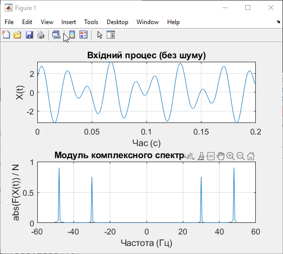
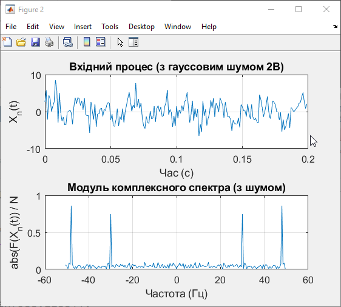

<div style="text-align:center; margin-top: 1cm;">
    <h3>Київський політехнічний інститут імені Ігоря Сікорського</h3>
    <h3>Факультет робототехніки та приладобудування</h3>
    <h4>Кафедра автоматизації та систем неруйнівного контролю</h4>
    <br><br><br>
</div>

<div style="text-align:center; margin-top: 5cm;">
    <h1>Практична робота № 1</h1>
    <h3>Дослідження спектрів періодичних сигналів</h3>
</div>

<div style="text-align:right; margin-top: 5cm;" >
Студент: Погорєлов Богдан<br>
Група: ПК51-мп<br>
Номер за списком: 12<br>
</div>
<div style="text-align:center; margin-top: 8cm;">
2026 рік  <br><br><br><br><br><br>
</div>

## 1. Мета роботи

Застосовуючи дискретне перетворення Фур'є (ДПФ), дослідити вплив параметрів (частоти і амплітуди сигналів, тривалості імпульсів, їх періоду, зміщення відносно початку координат) полігармонічних сигналів та періодичних послідовностей відео- та радіоімпульсів на амплітудно-частотний та фазочастотний спектри цих сигналів; дослідити ефект витоку спектру ДПФ.

## 2. Обладнання
* Програмний пакет **MatLAB** (або аналог GNU Octave)

## 3. Хід роботи та моделювання

**Розрахунок варіанта:**
Відповідно до інструкції, номер варіанта обчислюється як $K \pmod{10} + 1$, де $K$ — номер студента за списком.
Для $K = 12$: $12 \pmod{10} + 1 = 2 + 1 = 3$.
Параметри для **Варіанту 3** згідно з таблицею 2.1:
* Частоти: $f_1 = 48$ Гц, $f_2 = 30$ Гц
* Амплітуди: $U_1 = 1.8$ В, $U_2 = 1.5$ В

### 3.1. Програмний код (файл NSTOS_prakt1.m)

Програмний код розроблено для моделювання полігармонічного сигналу, знаходження його комплексного спектра за допомогою функції `fft` та `fftshift`, а також для дослідження впливу гауссового шуму (із середнім квадратичним відхиленням 2 В).

```matlab
% ПРАКТИЧНА РОБОТА № 1. ДОСЛІДЖЕННЯ СПЕКТРІВ ПЕРІОДИЧНИХ СИГНАЛІВ
% Номер за списком: 12. Варіант: 3.
close all; clear; clc;

% --- Параметри сигналу (Варіант 3) ---
f1 = 48;    % Гц
f2 = 30;    % Гц
U1 = 1.8;   % В
U2 = 1.5;   % В

% --- Параметри моделювання ---
t = 0:0.001:2;       % Часовий вектор
N = length(t);       % Обсяг вибірки
f = -500:0.5:500;    % Вектор частот (після fftshift)

% ==========================================
% ЧАСТИНА 1: Ідеальний полігармонічний сигнал
% ==========================================
x = U1*sin(2*pi*f1*t) + U2*cos(2*pi*f2*t);

% Знаходження спектру
y = fft(x);
v = fftshift(y);          % Центрування спектру
a = abs(v) / N;           % Нормований модуль комплексного спектра

% Побудова графіків (ідеальний сигнал)
figure(1);
subplot(2,1,1);
plot(t(1:200), x(1:200)); % Показуємо лише частину графіка для наочності
grid on;
set(gca,'FontName','Arial Cyr','FontSize',12);
title('Вхідний процес (без шуму)');
xlabel('Час (с)'); ylabel('X(t)');

subplot(2,1,2);
plot(f(900:1100), a(900:1100)); % Відображаємо діапазон частот навколо нуля
grid on;
set(gca,'FontName','Arial Cyr','FontSize',12);
title('Модуль комплексного спектра (без шуму)');
xlabel('Частота (Гц)'); ylabel('abs(F(X(t)) / N');

% ==========================================
% ЧАСТИНА 2: Сигнал із додаванням гауссового шуму
% ==========================================
% Формування шуму (СКО = 2В)
noise = 2 * randn(size(t));
xn = x + noise;

% Знаходження спектру зашумленого сигналу
yn = fft(xn);
vn = fftshift(yn);
an = abs(vn) / N;

% Побудова графіків (сигнал з шумом)
figure(2);
subplot(2,1,1);
plot(t(1:200), xn(1:200)); 
grid on;
set(gca,'FontName','Arial Cyr','FontSize',12);
title('Вхідний процес (з гауссовим шумом 2В)');
xlabel('Час (с)'); ylabel('X_n(t)');

subplot(2,1,2);
plot(f(900:1100), an(900:1100)); 
grid on;
set(gca,'FontName','Arial Cyr','FontSize',12);
title('Модуль комплексного спектра (з шумом)');
xlabel('Частота (Гц)'); ylabel('abs(F(X_n(t)) / N');

```

<div align="center">
    
    <p><i>Рис. 1. Чистий полігармонічний сигнал (30 Гц та 48 Гц) та його спектр.</i></p>
</div>

<div align="center">
    
    <p><i>Рис. 2. Сигнал із доданим гауссовим шумом та його спектр.</i></p>
</div>


## 5. Висновки

Під час виконання практичної роботи №1 було досліджено спектри періодичних полігармонічних сигналів за допомогою апарату дискретного перетворення Фур'є (ДПФ) у середовищі MatLAB.

Практично закріплено використання функцій `fft` (пряме перетворення) та `ifft` (зворотне перетворення). Було вивчено особливість формування масиву даних ДПФ та необхідність використання функції `fftshift` для коректного представлення двостороннього комплексного спектра. Нормування отриманого вектора на довжину вибірки $N$ дозволило точно визначити амплітуди складових (у двосторонньому спектрі вони дорівнювали $U_1/2$ та $U_2/2$).

Також було промодельовано вплив гауссового шуму з середнім квадратичним відхиленням $2\text{ В}$ на спектр. Встановлено, що незважаючи на сильне спотворення часової форми сигналу, спектральний аналіз дозволяє надійно ідентифікувати корисні гармонічні складові (піки на заданих частотах $48\text{ Гц}$ та $30\text{ Гц}$), оскільки енергія шуму рівномірно "розмазується" по всьому частотному діапазону. Це наочно ілюструє переваги частотних методів для виділення періодичних сигналів на фоні перешкод.

Відповіді на контрольні запитання

**1. Дайте означення періодичного сигналу.**
Періодичним називають сигнал $s(t)$, який задовольняє умові $s(t)=s(t+nT)$ для $-\infty < t < \infty$, де $T>0$ — період сигналу, а $n = \pm1, \pm2, \dots$

**2. Запишіть формулу для визначення постійної складової періодичного сигналу.**
Постійна складова періодичного сигналу (нульова гармоніка $a_0/2$) визначається за формулою:


$$ \frac{a_0}{2} = \frac{1}{T}\int_{-T/2}^{T/2} s(t)dt $$

**3. Запишіть формулу ряду Фур'є для періодичних сигналів.**
В основній тригонометричній формі ряд Фур'є записується як:


$$ s(t) = \frac{a_0}{2} + \sum_{n=1}^{\infty} \left[ a_n \cos(n\omega_1 t) + b_n \sin(n\omega_1 t) \right] $$

**4. Запишіть формулу ряду Фур'є для періодичного сигналу, що описується парною функцією.**
Для парної функції синусоїдні складові (коефіцієнти $b_n$) дорівнюють нулю. Тоді ряд набуває вигляду:


$$ s(t) = \frac{a_0}{2} + \sum_{n=1}^{\infty} a_n \cos(n\omega_1 t) $$

**5. Чим відрізняється амплітудно-частотні спектри періодичних сигналів у тригонометричному та комплексно-експоненційному базисах?**
У тригонометричному базисі спектр (АЧС) існує тільки для невід'ємних (додатних) частот. У комплексно-експоненційному базисі АЧС є симетричним (двостороннім) — існує для додатних і від'ємних частот. При цьому амплітуди кожної гармоніки в комплексному спектрі вдвічі менші за відповідні амплітуди в тригонометричному базисі (значення ділиться навпіл між додатною і від'ємною частотами).

**6. До яких змін у спектрі періодичного сигналу призводить зміщення сигналу у часі?**
Зміщення сигналу у часі на величину $\tau$ не змінює амплітудно-частотний спектр (модулі гармонік залишаються незмінними), але призводить до лінійної зміни фазочастотного спектра. До початкової фази кожної $n$-ї гармоніки додається зсув $\Delta\theta_n = -n\omega_1\tau$.

**7. Який існує зв'язок між шириною спектра періодичного сигналу та тривалістю його імпульсів?**
Між тривалістю імпульсів та шириною їх спектра існує обернено-пропорційна залежність: чим коротший імпульс у часовій області, тим ширший його спектр у частотній області (і навпаки).

**8. Що зміниться у спектрі періодичного сигналу, якщо його період збільшити вдвічі?**
Якщо період $T$ збільшити вдвічі, основна частота $\omega_1 = 2\pi/T$ зменшиться вдвічі. Отже, відстань між сусідніми спектральними лініями зменшиться вдвічі, і спектр стане вдвічі «густішим».

**9. Наведіть формули, що визначають співвідношення між косинусоїдними і синусоїдними коефіцієнтами ряду Фур'є та амплітудами і початковими фазами гармонік спектру періодичного сигналу?**
Співвідношення наступні:


$$ A_n = \sqrt{a_n^2 + b_n^2} $$

$$ \Theta_n = \text{arctg}\left(\frac{b_n}{a_n}\right) $$


Та зворотні перетворення:


$$ a_n = A_n \cos(\Theta_n), \quad b_n = A_n \sin(\Theta_n) $$

**10. Які сигнали називаються ортогональними?**
Два сигнали $s_1(t)$ та $s_2(t)$ називаються ортогональними на інтервалі $T$, якщо інтеграл від їхнього добутку на цьому інтервалі дорівнює нулю:


$$ \int_{-T/2}^{T/2} s_1(t)s_2(t)dt = 0 $$