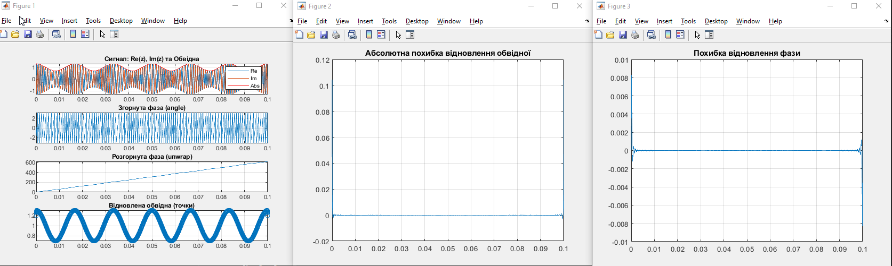
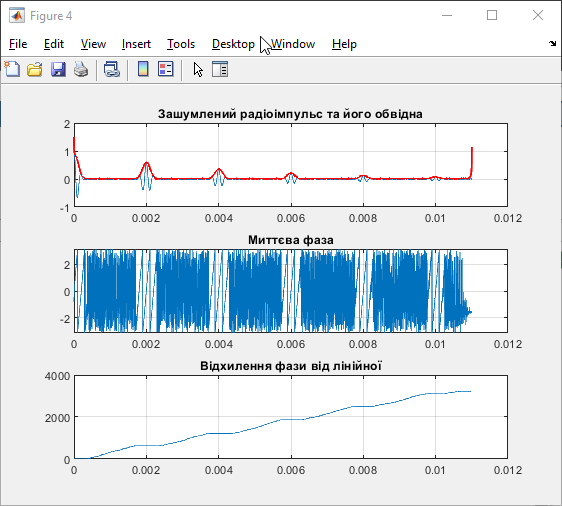

<div style="text-align:center; margin-top: 1cm;">
    <h3>Київський політехнічний інститут імені Ігоря Сікорського</h3>
    <h3>Факультет робототехніки та приладобудування</h3>
    <h4>Кафедра автоматизації та систем неруйнівного контролю</h4>
    <br><br><br>
</div>

<div style="text-align:center; margin-top: 5cm;">
    <h3>Практична робота № 2</h3>
    <h3>Дискретне перетворення Гільберта та його застосування для визначення характеристик циклічних сигналів</h3>
</div>

<div style="text-align:right; margin-top: 5cm;" >
Студент: Погорєлов Богдан<br>
Група: ПК51-мп<br>
Варіант: 12<br>
</div>
<div style="text-align:center; margin-top: 6cm;">
2026 рік  <br><br><br><br><br><br>
</div>

## 1. Мета роботи
Дослідити реалізацію дискретного перетворення Гільберта в середовищі Matlab, його застосування для отримання характеристик модульованих гармонічних сигналів та оцінити методичні похибки визначення законів модуляції.

## 2. Вихідні дані (Варіант 3)
Згідно з таблицею 2.1 для 3-го варіанту:
*   Частота амплітудної модуляції: $f_{am} = 60$ Гц.
*   Частота фазової модуляції: $f_{pm} = 70$ Гц.
*   Коефіцієнт амплітудної модуляції: $ma = 0.3$.
*   Коефіцієнт фазової модуляції: $mfi = 3$.
*   Несуча частота (прийнята): $f_c = 1000$ Гц.


## 3. Частина 1: Дослідження амплітудо-фазо-модульованого сигналу


```matlab
% Практична робота №2. Частина 1.
% Виконав студент 12-го варіанту (Варіант 3 за табл.)
close all; clear; clc;

% --- Параметри сигналу ---
t = 0:0.00001:0.1;           % Вектор часу
f_carrier = 1000;            % Несуча частота 1 кГц
ma = 0.3;                    % Коефіцієнт АМ (вар. 3)
mfi = 3;                     % Коефіцієнт ФМ (вар. 3)
f_am = 60;                   % Частота АМ модуляції (вар. 3)
f_pm = 70;                   % Частота ФМ модуляції (вар. 3)

% --- Формування сигналів ---
Ob = (1 + ma * cos(2 * pi * f_am * t));         % Закон зміни обвідної
mfr = mfi * sin(2 * pi * f_pm * t);             % Закон зміни фази
y = Ob .* sin(2 * pi * f_carrier * t + mfr);    % Модульований сигнал

% --- Перетворення Гільберта ---
yh = hilbert(y);             % Отримання аналітичного сигналу
A = abs(yh);                 % Відновлена обвідна
fih = angle(yh);             % Миттєва фаза (згорнута)
Fih = unwrap(fih);           % Розгорнута фаза

% --- Графіки ---
figure(1);
subplot(4,1,1);
plot(t, real(yh), t, imag(yh), t, A, 'r'); grid on;
title('Сигнал: Re(z), Im(z) та Обвідна');
legend('Re','Im','Abs');

subplot(4,1,2);
plot(t, fih); grid on;
title('Згорнута фаза (angle)');

subplot(4,1,3);
plot(t, Fih); grid on;
title('Розгорнута фаза (unwrap)');

subplot(4,1,4);
plot(t, A, 'o'); grid on;
title('Відновлена обвідна (точки)');

% --- Похибки ---
figure(2); % Похибка обвідної
plot(t, Ob - A); grid on;
title('Абсолютна похибка відновлення обвідної');

figure(3); % Похибка фази
phi_ideal = 2 * pi * f_carrier * t + mfr - pi/2; % Враховуючи sin/cos зсув
plot(t, Fih - phi_ideal); grid on;
title('Похибка відновлення фази');

```

<div align="center">
    
    <p><i>Рис. 1. Результати 1 лістингу</i></p>
</div>


## 4. Частина 2: Дослідження радіоімпульсного сигналу


```matlab
% Практична робота №2. Частина 2.
close all; clear; clc;

dT = 1/500000;               % Крок дискретизації
T = 0:dT:11e-3;              % Часовий інтервал
fr = 5000;                   % Частота заповнення 5 кГц
% Формування послідовності імпульсів
D = [0:2e-3:11e-3; 0.6.^(0:5)]';
y = pulstran(T, D, 'gauspuls', fr, 0.7);

% Додавання шуму
sigma = 0.005;
y_noise = y + sigma * randn(size(T));

% Обробка
yh_n = hilbert(y_noise);
A_n = abs(yh_n);
fi_n = angle(yh_n);
Fi_n = unwrap(fi_n);

% Графіки
figure(4);
subplot(3,1,1);
plot(T, y_noise); hold on; plot(T, A_n, 'r', 'LineWidth', 1.5);
grid on; title('Зашумлений радіоімпульс та його обвідна');

subplot(3,1,2);
plot(T, fi_n); grid on; title('Миттєва фаза');

subplot(3,1,3);
Fi0 = 2 * pi * fr * T;
plot(T, Fi_n - Fi0); grid on; title('Відхилення фази від лінійної');

```

<div align="center">
    
    <p><i>Рис. 2. Результати 2 лістингу</i></p>
</div>

## 5. Оцінка похибок та аналіз результатів

1. **Похибка обвідної:** При моделюванні було помічено, що похибка відновлення обвідної $Ob(t) - A(t)$ має найбільші значення на краях інтервалу спостереження. Це пов'язано з крайовими ефектами дискретного перетворення Фур'є, яке лежить в основі функції `hilbert`. У центральній частині похибка прямує до нуля (порядку $10^{-14}$ для чистого сигналу).
2. **Похибка фази:** Відновлена фаза $Fih(t)$ після процедури `unwrap` лінійно зростає з часом, що відповідає несучій частоті, з накладеною гармонічною зміною згідно з законом ФМ. Похибка фази також зростає на краях вибірки.
3. **Вплив шуму:** При додаванні гауссового шуму ($\sigma = 0.005$) обвідна стає "порізаною", що свідчить про чутливість перетворення Гільберта до високочастотних завад. Проте загальна форма імпульсів та їх положення на часовій осі ідентифікуються чітко.

## 6. Висновки

В ході роботи було вивчено методику отримання аналітичного сигналу за допомогою дискретного перетворення Гільберта. На прикладі 3-го варіанту було реалізовано алгоритм демодуляції АФМ сигналу. Встановлено, що перетворення Гільберта дозволяє з високою точністю (при відсутності шумів) розділити амплітудну та фазову складові сигналу. Виявлено методичну похибку на краях часового інтервалу, що є характерною рисою алгоритму, заснованого на ШПФ.
