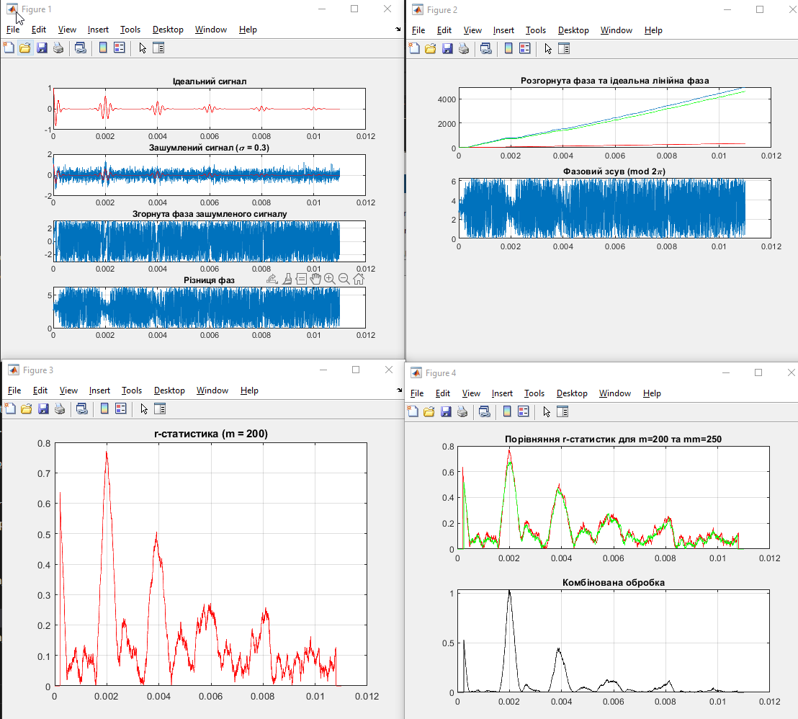

<div style="text-align:center; margin-top: 1cm;">
    <h3>Київський політехнічний інститут імені Ігоря Сікорського</h3>
    <h3>Факультет робототехніки та приладобудування</h3>
    <h4>Кафедра автоматизації та систем неруйнівного контролю</h4>
    <br><br><br>
</div>

<div style="text-align:center; margin-top: 5cm;">
    <h3>Практична робота № 3</h3>
    <h3>Використання кругових статистик в ультразвуковій товщинометрії</h3>
</div>

<div style="text-align:right; margin-top: 5cm;" >
Студент: Погорєлов Богдан<br>
Група: ПК51-мп<br>
Варіант: 12<br>
</div>
<div style="text-align:center; margin-top: 8cm;">
2026 рік  <br><br><br><br><br><br>
</div>

## 1. Мета роботи
Дослідити ефективність використання r-статистики в задачах виявлення сигналів лунаімпульсної ультразвукової товщинометрії (УЗТ), які спостерігаються на фоні значних адитивних шумів.

## 2. Вихідні дані (Варіант 3)
Відповідно до таблиці 3.1 для 3-го варіанту (К=12):
* Апертура першого ковзного вікна: $m = 200$
* Апертура другого ковзного вікна: $mm = 250$
* Середньоквадратичне відхилення шуму (Скв шуму): $\sigma = 0.3$


## 3. Програмний код моделювання (NSTOS_prakt3.m)

```matlab
% Практична робота №3: Виявлення сигналів УЗТ за r-статистикою
% Виконав: Погорєлов Богдан, Варіант 3
close all hidden; clear all; clc;

% --- Формування досліджуваного сигналу ---
dT = 1/50E4; 
T = 0:dT:11E-3; 
fr = 5E3; 
D = [0:2/1E3:10E-3; 0.6.^(0:5)]'; 
N = length(T); 
y = pulstran(T, D, 'gauspuls', fr, .5); 

% Додавання шуму (Варіант 3)
sigma = 0.3; 
y1 = y + sigma.*randn(1,N); 

% --- Отримання та аналіз r-статистики ---
yh = zeros(1,N); yh1 = zeros(1,N); fi = zeros(1, N); fi1 = zeros(1,N);
A = zeros(1, N); A1 = zeros(1,N); Fi = zeros(1,N); Fi1 = zeros(1,N);
r = zeros(1,N); r1 = zeros(1, N); 

yh = hilbert(y); yh1 = hilbert(y1); 
fi = atan2(imag(yh),y); fi1 = atan2(imag(yh1),y1); 
Fi1 = unwrap(fi1); 
A = sqrt(y.^2 + yh.^2); A1 = sqrt(y1.^2 + yh1.^2); 

% Графіки часових реалізацій
figure(1);
subplot(4,1,1); plot(T, y, 'r'); grid on; title('Ідеальний сигнал');
subplot(4,1,2); plot(T, y1, T, y, 'r'); grid on; title('Зашумлений сигнал (\sigma = 0.3)');
subplot(4,1,3); plot(T, fi1); grid on; title('Згорнута фаза зашумленого сигналу');

Fi0 = 2.*pi.*fr.*T; 
dfi = mod(fi1 - Fi0 + pi, 2.*pi); 
subplot(4,1,4); plot(T, dfi); grid on; title('Різниця фаз');

% Графіки розгорнутої фази
figure(2);
subplot(3,1,1); plot(T, Fi1, T, Fi0, 'r', T, Fi1-Fi0, 'g'); grid on; title('Розгорнута фаза та ідеальна лінійна фаза');
subplot(3,1,2); plot(T, mod(Fi1-Fi0+pi, 2.*pi)); grid on; title('Фазовий зсув (mod 2\pi)');

% --- Перше ковзне вікно (Варіант 3: m = 200) ---
m = 200; 
for l = 1:1:N-m 
    dfix = fi1(l:(l+m)) - Fi0(l:(l+m)); 
    S = sum(sin(dfix)); C = sum(cos(dfix)); 
    Z = C + 1i.*S; 
    r(l+m/2) = abs(Z) ./ length(dfix); 
end 

figure(3);
plot(T, r, 'r'); grid on; hold on; title('r-статистика (m = 200)');

% --- Друге ковзне вікно (Варіант 3: mm = 250) ---
mm = 250; rm = zeros(1,N); 
for l = 1:1:N-mm 
    dfix = fi1(l:(l+mm)) - Fi0(l:(l+mm)); 
    S = sum(sin(dfix)); C = sum(cos(dfix)); 
    Z = C + 1i.*S; 
    rm(l+mm/2) = abs(Z) ./ length(dfix); 
end 

figure(4);
subplot(2,1,1); plot(T, r, 'r', T, rm, 'g'); grid on; title('Порівняння r-статистик для m=200 та mm=250');
subplot(2,1,2); plot(T, r.*rm.*2, 'k'); grid on; title('Комбінована обробка');

```

* **`pulstran`**: Формує послідовність імпульсів на основі заданого базового імпульсу (у нашому випадку `gauspuls`) із заданими затримками та амплітудами.
* **`gauspuls`**: Генерує радіоімпульс із гауссовою обвідною, що моделює реальний луна-сигнал УЗТ.
* **`hilbert`**: Здійснює дискретне перетворення Гільберта, повертаючи аналітичний сигнал (комплексний вектор, де дійсна частина — це вихідний сигнал, а уявна — його гільберт-образ).
* **`atan2`**: Обчислює арктангенс з урахуванням квадранта. Використовується для знаходження миттєвої (згорнутої) фази аналітичного сигналу.
* **`unwrap`**: Здійснює розгортання фази, усуваючи стрибки на $2\pi$, забезпечуючи неперервну фазову характеристику.
* `sum(sin(...))` / `sum(cos(...))`: Використовуються для знаходження проекцій ортів фазових зсувів на осі координат для розрахунку параметрів $C$ та $S$ кругової статистики.


## Результати моделювання (Графіки)

**Аналіз відношення сигнал/шум:**
За рахунок властивостей r-статистики (інваріантність до початкової фази та стабільність в межах імпульсу), корисний сигнал виділяється у вигляді чітких піків, що наближаються до одиниці, тоді як шумовий фон коливається на значно нижчому рівні (близько $1/\sqrt{m}$). Це дозволяє впевнено фіксувати донні імпульси навіть при значному рівні адитивного шуму.


<div align="center">
    
    <p><i>Рис. 1. Результати 1 лістингу</i></p>
</div>

## Відповіді на контрольні запитання

**1. Дайте означення періодичного сигналу.**
Періодичним називають сигнал $s(t)$, який повторює свої значення через певний інтервал часу $T$ (період), тобто задовольняє умові $s(t) = s(t + nT)$, де $n = \pm 1, \pm 2, \dots$

**2. Запишіть формулу для визначення дискретної фазової характеристики сигналу.**


$$ \Phi[j] = \text{arctg}\frac{\hat{u}[j]}{u[j]} + L[\hat{u}[j], u[j]] $$


де $u[j]$ — вибірка сигналу, $\hat{u}[j]$ — її гільберт-образ, $L$ — оператор розгортання фази.

**3. Запишіть формулу для визначення дискретної частотної характеристики сигналу.**


$$ \Psi[j] = \frac{\Phi[j] - \Phi[j-1]}{2\pi T_{\text{д}}} $$


де $T_{\text{д}}$ — період дискретизації.

**4. Запишіть формулу для визначення r-статистики даних фазових вимірювань.**


$$ r = \sqrt{C^2 + S^2} $$


де $C = \frac{1}{M}\sum_{j=1}^{M}\cos\varphi[j]$ та $S = \frac{1}{M}\sum_{j=1}^{M}\sin\varphi[j]$.

**5. Як впливає розмір апертури вікна на форму імпульсів r-статистики під час аналізу фазових характеристик сигналів?**
Збільшення апертури вікна $m$ призводить до кращого усереднення шуму (зменшення флуктуацій фону), але при цьому імпульси r-статистики стають ширшими, що знижує роздільну здатність за часом. Занадто мале вікно призводить до значних шумових викидів, що ускладнює виявлення сигналу.

**6. До яких змін у формі імпульсів r-статистики призводить зменшення відношення сигнал/шум?**
Зменшення відношення сигнал/шум (наприклад, збільшення $\sigma$) призводить до зниження амплітуди піків r-статистики (вони вже не досягають значення 1) та підвищення рівня шумового фону між імпульсами. При надзвичайно низькому SNR піки можуть злитися з фоном.

**7. Як пов'язані кругова дисперсія та r-статистика, визначені для кругових даних?**
Кругова дисперсія пов'язана з r-статистикою лінійною залежністю:


$$ V = 1 - r $$


Чим більше значення r-статистики (ближче до 1, сильна концентрація фаз), тим менша кругова дисперсія (прямує до 0).

## 7. Висновки

Під час виконання практичної роботи було досліджено ефективність застосування методів кругової статистики (зокрема, r-статистики) для виявлення лунаімпульсних сигналів УЗТ на фоні гауссового шуму.

Шляхом розрахунку аналітичного сигналу (за допомогою перетворення Гільберта) та виділення миттєвої фази було показано, що різниця фаз між досліджуваним сигналом та опорним гармонічним коливанням залишається відносно стабільною протягом дії корисного імпульсу. Опрацювання цієї різниці фаз ковзним вікном дозволяє сформувати r-статистику, яка має значення близькі до одиниці в моменти присутності лунаімпульсів і прямує до нуля (в середньому) на ділянках чистого шуму.

Дослідження показало високу завадостійкість даного методу: навіть при середньоквадратичному відхиленні шуму $\sigma = 0.3$, імпульси впевнено виділяються. Зміна розміру ковзного вікна ($m=200$ та $mm=250$) підтвердила компроміс між згладжуванням фону та шириною результуючого імпульсу. Комбінована обробка двома вікнами підвищує точність і надійність локалізації імпульсів у часі.
